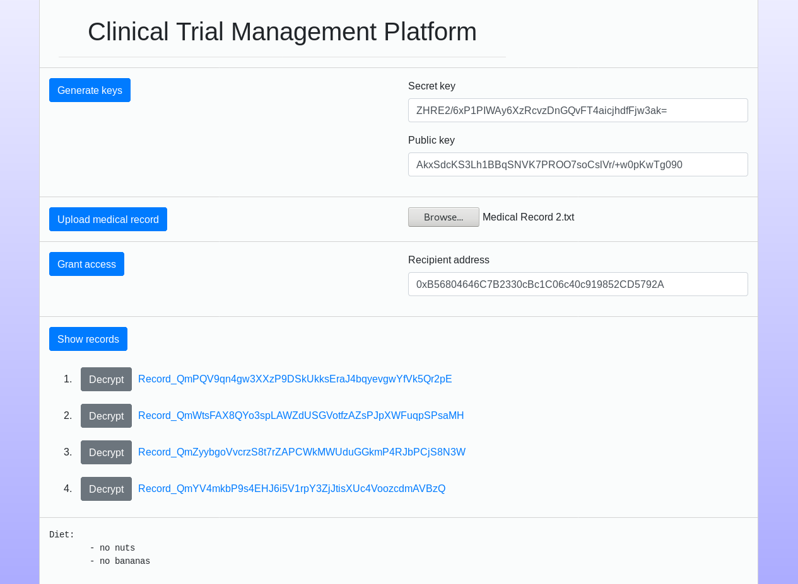

# Clinical Trial Management Using Blockchain Technology

This platform simplifies the recruitment process of clinical trials by allowing faster communication between patients and representatives of pharmaceutical institutions. Patients can securely upload their medical records and grant access to medical professionals.


<br></br>
## Requirements
Make sure that you have installed the following software:
- [Ganache](https://github.com/trufflesuite/ganache)
- [IPFS](https://github.com/ipfs/go-ipfs)
- [MetaMask](https://metamask.io/)
- [NPM](https://www.npmjs.com/get-npm)
- [Python](https://www.python.org/downloads/) (at least version 3.5)
- [pyUmbral](https://github.com/nucypher/pyUmbral)


<br></br>
## Setup
### Ganache
Inside the Ganache directory, start the blockchain:
```
sudo npm start
```


### Repository
Clone the repository:
```
git clone https://github.com/janetzki/Clinical-Trial-Management-Using-Blockchain-Technology
```

Navigate into its main directory, then install the requirements:
```
sudo npm install
```


### Smart Contract
Initialize the smart contract:
```
cd truffle
sudo truffle compile
sudo truffle migrate
```
(Troubleshooting: If the migration step fails, delete the `truffle/build/` directory and try again.)


### IPFS
Start the IPFS daemon:
```
ipfs init
ipfs daemon
```

Allow local requests to the IPFS daemon:
```
ipfs config --json API.HTTPHeaders.Access-Control-Allow-Origin '["http://localhost"]'
```


### Key Management System
From the main directory, start the key management system:
```
python kms_server.py
```


### Web Server
Start the web server:
```
sudo npm start
```
You can now access the platform at `localhost:80` in your browser.

Use MetaMask to connect to the Ganache blockchain. Do not forget to reset your accounts if you used them before.


<br></br>
## Usage
First, log in as a patient or medical professional by clicking the respective button. You should see a new web page.


### As a Patient
Note that the following steps require to interact with MetaMask.
- Click "Generate keys" to generate a new key pair and store the secret key at a safe location. The public key is stored on the blockchain and will be loaded when you refresh the window. You need to re-enter the secret key manually.
- Click "Browse" to select a medical record. Examples can be found in `examples/records/`. Click "Upload medical record" to upload it to the platform.
- Click "Show records" to see a list of the hash pointers to your uploaded records. Open the link in a new window to see the encrypted content. Click "Decrypt" to see its original content.
- You can grant access to a medical professional, who already has a key pair. If not, first log in as a medical professional as described below. Then enter its blockchain address into the text field and click "Grant access". In MetaMask, you can choose the files for which you want to grant access.


### As a Medical Professional
Note that you need to use another blockchain account in MetaMask to log in as another user. This works best with two different browsers.
- Like for the patient, generate a key pair and store the secret key at a safe location.
- Enter the blockchain address of a patient that granted access to their medical records.
- Click "Show records" to see a full list of all accessible medical records for this patient. You can use "Decrypt" and the link in the same way as the owner of the record.


<br></br>
## Test the Smart Contract
```
cd truffle
truffle test
```


<br></br>
## Note for Developers
If you make changes to `web_pages/user.js`, apply the tool [browserify](http://browserify.org/) to make it usable by browsers:
```
browserify web_pages/user.js > web_pages/user-browser.js
```
